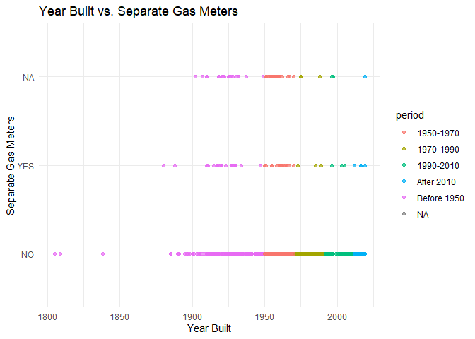
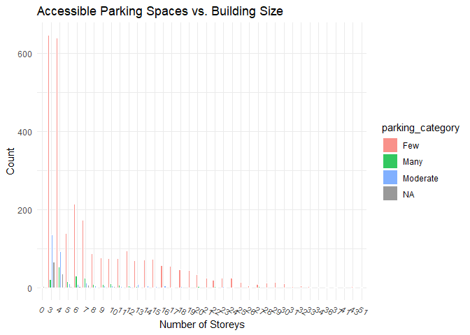
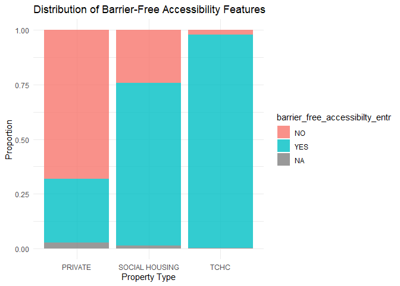
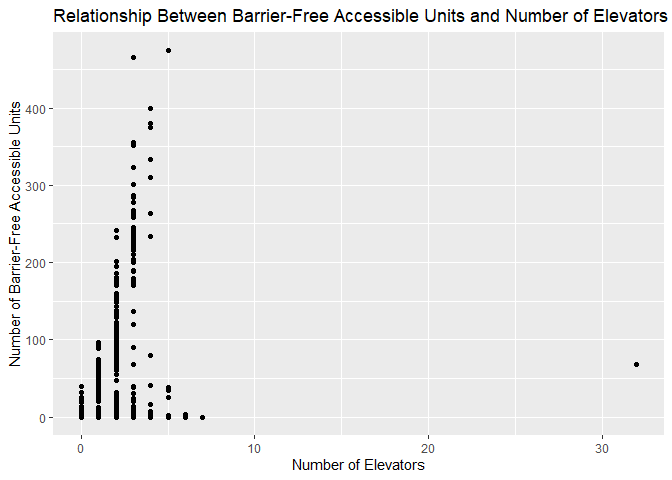

Mini Data Analysis Milestone 2
================

*To complete this milestone, you can either edit [this `.rmd`
file](https://raw.githubusercontent.com/UBC-STAT/stat545.stat.ubc.ca/master/content/mini-project/mini-project-2.Rmd)
directly. Fill in the sections that are commented out with
`<!--- start your work here--->`. When you are done, make sure to knit
to an `.md` file by changing the output in the YAML header to
`github_document`, before submitting a tagged release on canvas.*

# Welcome to the rest of your mini data analysis project!

In Milestone 1, you explored your data. and came up with research
questions. This time, we will finish up our mini data analysis and
obtain results for your data by:

- Making summary tables and graphs
- Manipulating special data types in R: factors and/or dates and times.
- Fitting a model object to your data, and extract a result.
- Reading and writing data as separate files.

We will also explore more in depth the concept of *tidy data.*

**NOTE**: The main purpose of the mini data analysis is to integrate
what you learn in class in an analysis. Although each milestone provides
a framework for you to conduct your analysis, it’s possible that you
might find the instructions too rigid for your data set. If this is the
case, you may deviate from the instructions – just make sure you’re
demonstrating a wide range of tools and techniques taught in this class.

# Instructions

**To complete this milestone**, edit [this very `.Rmd`
file](https://raw.githubusercontent.com/UBC-STAT/stat545.stat.ubc.ca/master/content/mini-project/mini-project-2.Rmd)
directly. Fill in the sections that are tagged with
`<!--- start your work here--->`.

**To submit this milestone**, make sure to knit this `.Rmd` file to an
`.md` file by changing the YAML output settings from
`output: html_document` to `output: github_document`. Commit and push
all of your work to your mini-analysis GitHub repository, and tag a
release on GitHub. Then, submit a link to your tagged release on canvas.

**Points**: This milestone is worth 50 points: 45 for your analysis, and
5 for overall reproducibility, cleanliness, and coherence of the Github
submission.

**Research Questions**: In Milestone 1, you chose two research questions
to focus on. Wherever realistic, your work in this milestone should
relate to these research questions whenever we ask for justification
behind your work. In the case that some tasks in this milestone don’t
align well with one of your research questions, feel free to discuss
your results in the context of a different research question.

# Learning Objectives

By the end of this milestone, you should:

- Understand what *tidy* data is, and how to create it using `tidyr`.
- Generate a reproducible and clear report using R Markdown.
- Manipulating special data types in R: factors and/or dates and times.
- Fitting a model object to your data, and extract a result.
- Reading and writing data as separate files.

# Setup

Begin by loading your data and the tidyverse package below:

``` r
library(datateachr) # <- might contain the data you picked!
library(tidyverse)
library(dplyr)
library(ggplot2)
```

# Task 1: Process and summarize your data

From milestone 1, you should have an idea of the basic structure of your
dataset (e.g. number of rows and columns, class types, etc.). Here, we
will start investigating your data more in-depth using various data
manipulation functions.

### 1.1 (1 point)

First, write out the 4 research questions you defined in milestone 1
were. This will guide your work through milestone 2:

<!-------------------------- Start your work below ---------------------------->

1.  Is there a correlation between the year a building was built
    (year_built) and the availability of energy-efficient features such
    as separate gas/hydro meters, sprinkler systems, or thermal windows?
2.  How does the number of accessible parking spaces relate to the size
    of the building (number of storeys or number of units)?
3.  What is the distribution of barrier-free accessibility features in
    the dataset, and how does it vary across different types of
    buildings (e.g., privately owned vs. social housing)?
4.  What is the relationship between the number of barrier-free
    accessible units and the number of elevators in a building?  
    <!----------------------------------------------------------------------------->

Here, we will investigate your data using various data manipulation and
graphing functions.

### 1.2 (8 points)

Now, for each of your four research questions, choose one task from
options 1-4 (summarizing), and one other task from 4-8 (graphing). You
should have 2 tasks done for each research question (8 total). Make sure
it makes sense to do them! (e.g. don’t use a numerical variables for a
task that needs a categorical variable.). Comment on why each task helps
(or doesn’t!) answer the corresponding research question.

Ensure that the output of each operation is printed!

Also make sure that you’re using dplyr and ggplot2 rather than base R.
Outside of this project, you may find that you prefer using base R
functions for certain tasks, and that’s just fine! But part of this
project is for you to practice the tools we learned in class, which is
dplyr and ggplot2.

**Summarizing:**

1.  Compute the *range*, *mean*, and *two other summary statistics* of
    **one numerical variable** across the groups of **one categorical
    variable** from your data.
2.  Compute the number of observations for at least one of your
    categorical variables. Do not use the function `table()`!
3.  Create a categorical variable with 3 or more groups from an existing
    numerical variable. You can use this new variable in the other
    tasks! *An example: age in years into “child, teen, adult, senior”.*
4.  Compute the proportion and counts in each category of one
    categorical variable across the groups of another categorical
    variable from your data. Do not use the function `table()`!

**Graphing:**

6.  Create a graph of your choosing, make one of the axes logarithmic,
    and format the axes labels so that they are “pretty” or easier to
    read.
7.  Make a graph where it makes sense to customize the alpha
    transparency.

Using variables and/or tables you made in one of the “Summarizing”
tasks:

8.  Create a graph that has at least two geom layers.
9.  Create 3 histograms, with each histogram having different sized
    bins. Pick the “best” one and explain why it is the best.

Make sure it’s clear what research question you are doing each operation
for!

<!------------------------- Start your work below ----------------------------->

#### 1.2.1 Is there a correlation between the year a building was built (year_built) and the availability of energy-efficient features such as separate gas/hydro meters, sprinkler systems, or thermal windows?

``` r
# Compute the range, mean, and two other summary statistics of the year built across the groups of a categorical variable.

# Create a categorical variable based on the year_built
buildings_year_stat <- apt_buildings %>%
  mutate(period = case_when(
    year_built < 1950 ~ "Before 1950",
    between(year_built, 1950, 1970) ~ "1950-1970",
    between(year_built, 1970, 1990) ~ "1970-1990",
    between(year_built, 1990, 2010) ~ "1990-2010",
    year_built > 2010 ~ "After 2010"
  ))

# Compute summary statistics
ans1.2.1 <- buildings_year_stat %>%
  group_by(period) %>%
  summarize(
    range = paste(min(year_built), "-", max(year_built)),
    mean_year = mean(year_built),
    median_year = median(year_built),
    sd_year = sd(year_built)
  )

print(ans1.2.1)
```

    ## # A tibble: 6 × 5
    ##   period      range       mean_year median_year sd_year
    ##   <chr>       <chr>           <dbl>       <dbl>   <dbl>
    ## 1 1950-1970   1950 - 1970     1961.        1960    5.78
    ## 2 1970-1990   1971 - 1990     1977.        1975    5.83
    ## 3 1990-2010   1991 - 2010     1997.        1994    6.44
    ## 4 After 2010  2011 - 2019     2015.        2015    2.58
    ## 5 Before 1950 1805 - 1949     1927.        1929   16.1 
    ## 6 <NA>        NA - NA           NA           NA   NA

This task allows us to understand the distribution of building years
over different periods.

``` r
# Make a graph where it makes sense to customize the alpha transparency.

# Create a scatter plot to visualize the relationship
ggplot(buildings_year_stat, aes(x = year_built, y = separate_gas_meters, color = period)) +
  geom_point(alpha = 0.7) +
  labs(title = "Year Built vs. Separate Gas Meters",
       x = "Year Built",
       y = "Separate Gas Meters") +
  theme_minimal()
```

    ## Warning: Removed 13 rows containing missing values (`geom_point()`).

<!-- -->

Scatter plots are suitable for visualizing the relationship between the
year of construction of a building and the availability of individual
gas meters. Use alpha transparency to help visualize overlapping points
and understand the density of data points. Different colors represent
different periods, providing a comprehensive view of correlations.

#### 1.2.2 How does the number of accessible parking spaces relate to the size of the building (number of storeys or number of units)?

``` r
# Create a categorical variable with 3 or more groups from an existing numerical variable.

# Define thresholds for categorization
threshold_low <- 10
threshold_high <- 30

# Create a categorical variable
ans1.2.2 <- apt_buildings %>%
  mutate(parking_category = case_when(
    no_of_accessible_parking_spaces <= threshold_low ~ "Few",
    between(no_of_accessible_parking_spaces, threshold_low + 1, threshold_high) ~ "Moderate",
    no_of_accessible_parking_spaces > threshold_high ~ "Many"
  ))

# Display the updated dataset
head(ans1.2.2)
```

    ## # A tibble: 6 × 38
    ##      id air_conditioning amenities balconies barrier_free_accessi…¹ bike_parking
    ##   <dbl> <chr>            <chr>     <chr>     <chr>                  <chr>       
    ## 1 10359 NONE             Outdoor … YES       YES                    0 indoor pa…
    ## 2 10360 NONE             Outdoor … YES       NO                     0 indoor pa…
    ## 3 10361 NONE             <NA>      YES       NO                     Not Availab…
    ## 4 10362 NONE             <NA>      YES       YES                    Not Availab…
    ## 5 10363 NONE             <NA>      NO        NO                     12 indoor p…
    ## 6 10364 NONE             <NA>      NO        NO                     Not Availab…
    ## # ℹ abbreviated name: ¹​barrier_free_accessibilty_entr
    ## # ℹ 32 more variables: exterior_fire_escape <chr>, fire_alarm <chr>,
    ## #   garbage_chutes <chr>, heating_type <chr>, intercom <chr>,
    ## #   laundry_room <chr>, locker_or_storage_room <chr>, no_of_elevators <dbl>,
    ## #   parking_type <chr>, pets_allowed <chr>, prop_management_company_name <chr>,
    ## #   property_type <chr>, rsn <dbl>, separate_gas_meters <chr>,
    ## #   separate_hydro_meters <chr>, separate_water_meters <chr>, …

By classifying the number of available parking spaces, we can better
understand the distribution and make comparisons between different
groups.

``` r
# Create a graph that has at least two geom layers.

ggplot(ans1.2.2, aes(x = factor(no_of_storeys), fill = parking_category)) +
  geom_bar(position = position_dodge2(preserve = "single"), color = "white", alpha = 0.8, width = 0.8) +
  labs(title = "Accessible Parking Spaces vs. Building Size",
       x = "Number of Storeys",
       y = "Count") +
  theme_minimal() +
  theme(
    axis.text.x = element_text(angle = -30, hjust = 0)
  )
```

<!-- -->

This bar chart visually displays the relationship between the number of
parking spaces available and the size of the building (number of
floors). I use different colors for each parking category allows for
clear comparisons.

#### 1.2.3 What is the distribution of barrier-free accessibility features in the dataset, and how does it vary across different types of buildings (e.g., privately owned vs. social housing)?

``` r
# Compute the proportion and counts in each category of one categorical variable across the groups of another categorical variable from your data.

# Compute the counts and proportions
ans1.2.3 <- apt_buildings %>%
  group_by(property_type, barrier_free_accessibilty_entr) %>%
  summarise(count = n()) %>%
  mutate(proportion = count / sum(count))
```

    ## `summarise()` has grouped output by 'property_type'. You can override using the
    ## `.groups` argument.

``` r
ans1.2.3
```

    ## # A tibble: 9 × 4
    ## # Groups:   property_type [3]
    ##   property_type  barrier_free_accessibilty_entr count proportion
    ##   <chr>          <chr>                          <int>      <dbl>
    ## 1 PRIVATE        NO                              1969    0.682  
    ## 2 PRIVATE        YES                              841    0.291  
    ## 3 PRIVATE        <NA>                              78    0.0270 
    ## 4 SOCIAL HOUSING NO                                58    0.242  
    ## 5 SOCIAL HOUSING YES                              179    0.746  
    ## 6 SOCIAL HOUSING <NA>                               3    0.0125 
    ## 7 TCHC           NO                                 7    0.0214 
    ## 8 TCHC           YES                              319    0.976  
    ## 9 TCHC           <NA>                               1    0.00306

This task provides insights into the distribution of accessibility
features in different types of buildings. By counting quantities and
proportions, we can understand how common these features are across
various building categories, helping to address research questions about
variations in accessibility between different building types.

``` r
# Create a stacked bar plot with customized alpha transparency

ggplot(ans1.2.3, aes(x = property_type, y = proportion, fill = barrier_free_accessibilty_entr)) +
  geom_bar(stat = "identity", position = "stack", alpha = 0.8) +
  labs(title = "Distribution of Barrier-Free Accessibility Features",
       x = "Property Type",
       y = "Proportion") +
  theme_minimal()
```

<!-- -->

A stacked bar plot is suitable for visualizing the distribution of
barrier-free accessibility features across different types of buildings.

#### 1.2.4 What is the relationship between the number of barrier-free accessible units and the number of elevators in a building?

``` r
# Compute the range, mean, and two other summary statistics of one numerical variable across the groups of one categorical variable from your data.

ans1.2.4 <- apt_buildings %>%
  group_by(no_of_elevators) %>%
  summarize(
    mean_barrier_units = mean(no_barrier_free_accessible_units),
    range_barrier_units = max(no_barrier_free_accessible_units) - min(no_barrier_free_accessible_units),
    sd_barrier_units = sd(no_barrier_free_accessible_units),
    median_barrier_units = median(no_barrier_free_accessible_units)
  )

print(ans1.2.4)
```

    ## # A tibble: 11 × 5
    ##    no_of_elevators mean_barrier_units range_barrier_units sd_barrier_units
    ##              <dbl>              <dbl>               <dbl>            <dbl>
    ##  1               0              NA                     NA            NA   
    ##  2               1              NA                     NA            NA   
    ##  3               2              NA                     NA            NA   
    ##  4               3              NA                     NA            NA   
    ##  5               4              NA                     NA            NA   
    ##  6               5              28.8                  474           105.  
    ##  7               6               1.14                   3             1.21
    ##  8               7               0                      0            NA   
    ##  9              15              NA                     NA            NA   
    ## 10              32              68                      0            NA   
    ## 11              NA              NA                     NA            NA   
    ## # ℹ 1 more variable: median_barrier_units <dbl>

This task provides a statistical summary of the relationship between the
number of accessible units and the number of elevators in a building.
Means, ranges, and other statistics help understand the central tendency
and variability of accessible units across elevator categories.

``` r
apt_buildings %>%
  ggplot(aes(x = no_of_elevators, y = no_barrier_free_accessible_units)) +
  geom_point() +
  labs(
    title = "Relationship Between Barrier-Free Accessible Units and Number of Elevators",
    x = "Number of Elevators",
    y = "Number of Barrier-Free Accessible Units"
  )
```

    ## Warning: Removed 157 rows containing missing values (`geom_point()`).

<!-- -->

A scatter plot is chosen to visualize the relationship between two
numerical variables, the number of barrier-free accessible units, and
the number of elevators.

<!----------------------------------------------------------------------------->

### 1.3 (2 points)

Based on the operations that you’ve completed, how much closer are you
to answering your research questions? Think about what aspects of your
research questions remain unclear. Can your research questions be
refined, now that you’ve investigated your data a bit more? Which
research questions are yielding interesting results?

<!------------------------- Write your answer here ---------------------------->

1.  Is there a correlation between the year a building was built
    (year_built) and the availability of energy-efficient features such
    as separate gas/hydro meters, sprinkler systems, or thermal windows?

    In this problem we use a scatter plot to illustrate the relationship
    between construction time and separate gas meter. We can clearly see
    the difference between having a separate gas meter and not having a
    separate gas meter in different time periods. I think this question
    is answered very well and does not need to be modified.

2.  How does the number of accessible parking spaces relate to the size
    of the building (number of storeys or number of units)?

    In this problem, we can see the distribution of parking spaces on
    different floors through histograms. We classify parking spaces to
    make the presentation of the histogram more intuitive. I think this
    question is answered very well and does not need to be modified.

3.  What is the distribution of barrier-free accessibility features in
    the dataset, and how does it vary across different types of
    buildings (e.g., privately owned vs. social housing)?

    In this question, we use a histogram and can clearly see the
    proportion of different accessibility facilities in different
    property types. I think this question is answered very well and does
    not need to be modified.

4.  What is the relationship between the number of barrier-free
    accessible units and the number of elevators in a building?

    In the answer to this question, it is difficult to observe the
    relationship between barrier-free facilities and the number of
    elevators through a scatter plot. I think this question can be
    modified to study the relationship between barrier-free facilities
    and building floors

<!----------------------------------------------------------------------------->

# Task 2: Tidy your data

In this task, we will do several exercises to reshape our data. The goal
here is to understand how to do this reshaping with the `tidyr` package.

A reminder of the definition of *tidy* data:

- Each row is an **observation**
- Each column is a **variable**
- Each cell is a **value**

### 2.1 (2 points)

Based on the definition above, can you identify if your data is tidy or
untidy? Go through all your columns, or if you have \>8 variables, just
pick 8, and explain whether the data is untidy or tidy.

<!--------------------------- Start your work below --------------------------->

I select 8 variables in the apt_buildings dataset. From the selected
dataset ans2.1 shown below, we can see that each column represents a
variable, each row an observation, and each cell a value. The dataset is
already a tidy dataset.

``` r
ans2.1 <- apt_buildings %>% 
  select(id, no_of_elevators, rsn, year_built, year_registered, no_of_storeys, no_of_units, no_barrier_free_accessible_units)
print(ans2.1)
```

    ## # A tibble: 3,455 × 8
    ##       id no_of_elevators     rsn year_built year_registered no_of_storeys
    ##    <dbl>           <dbl>   <dbl>      <dbl>           <dbl>         <dbl>
    ##  1 10359               3 4154812       1967            2017            17
    ##  2 10360               3 4154815       1970            2017            14
    ##  3 10361               0 4155295       1927            2017             4
    ##  4 10362               1 4155309       1959            2017             5
    ##  5 10363               0 4155318       1943            2017             4
    ##  6 10364               0 4155322       1952              NA             4
    ##  7 10365               0 4155325       1959            2017             4
    ##  8 10366               2 4155928       1971            2017             7
    ##  9 10367               4 4155952       1969            2017            32
    ## 10 10368               2 4155991       1972            2017             4
    ## # ℹ 3,445 more rows
    ## # ℹ 2 more variables: no_of_units <dbl>, no_barrier_free_accessible_units <dbl>

<!----------------------------------------------------------------------------->

### 2.2 (4 points)

Now, if your data is tidy, untidy it! Then, tidy it back to it’s
original state.

If your data is untidy, then tidy it! Then, untidy it back to it’s
original state.

Be sure to explain your reasoning for this task. Show us the “before”
and “after”.

<!--------------------------- Start your work below --------------------------->

``` r
# tidy to untidy
untidy_2.2 <- ans2.1 %>%
  gather(key = "variable", value = "value", -id) %>%
  arrange(id)

untidy_2.2
```

    ## # A tibble: 24,185 × 3
    ##       id variable                           value
    ##    <dbl> <chr>                              <dbl>
    ##  1 10359 no_of_elevators                        3
    ##  2 10359 rsn                              4154812
    ##  3 10359 year_built                          1967
    ##  4 10359 year_registered                     2017
    ##  5 10359 no_of_storeys                         17
    ##  6 10359 no_of_units                          218
    ##  7 10359 no_barrier_free_accessible_units       2
    ##  8 10360 no_of_elevators                        3
    ##  9 10360 rsn                              4154815
    ## 10 10360 year_built                          1970
    ## # ℹ 24,175 more rows

``` r
# untidy to tidy
tidy_2.2 <- untidy_2.2 %>%
  spread(key = "variable", value = "value")

tidy_2.2
```

    ## # A tibble: 3,455 × 8
    ##       id no_barrier_free_acce…¹ no_of_elevators no_of_storeys no_of_units    rsn
    ##    <dbl>                  <dbl>           <dbl>         <dbl>       <dbl>  <dbl>
    ##  1 10359                      2               3            17         218 4.15e6
    ##  2 10360                      0               3            14         206 4.15e6
    ##  3 10361                      0               0             4          34 4.16e6
    ##  4 10362                     42               1             5          42 4.16e6
    ##  5 10363                      0               0             4          25 4.16e6
    ##  6 10364                     NA               0             4          34 4.16e6
    ##  7 10365                     14               0             4          14 4.16e6
    ##  8 10366                      0               2             7         105 4.16e6
    ##  9 10367                      0               4            32         571 4.16e6
    ## 10 10368                      1               2             4         171 4.16e6
    ## # ℹ 3,445 more rows
    ## # ℹ abbreviated name: ¹​no_barrier_free_accessible_units
    ## # ℹ 2 more variables: year_built <dbl>, year_registered <dbl>

<!----------------------------------------------------------------------------->

### 2.3 (4 points)

Now, you should be more familiar with your data, and also have made
progress in answering your research questions. Based on your interest,
and your analyses, pick 2 of the 4 research questions to continue your
analysis in the remaining tasks:

<!-------------------------- Start your work below ---------------------------->

1.  *Is there a correlation between the year a building was built
    (year_built) and the availability of energy-efficient features such
    as separate gas/hydro meters, sprinkler systems, or thermal
    windows?*
2.  *How does the number of accessible parking spaces relate to the size
    of the building (number of storeys or number of units)?*

<!----------------------------------------------------------------------------->

Explain your decision for choosing the above two research questions.

<!--------------------------- Start your work below --------------------------->

1.  This question is valuable for understanding the evolution of
    energy-efficient features in buildings over time. By examining the
    correlation between the year a building was built and the
    availability of energy-efficient features, we can identify trends
    and patterns in the adoption of these technologies.
2.  Investigating how the number of accessible parking spaces relates to
    the size of the building is crucial for urban planning and
    accessibility considerations. Understanding whether larger buildings
    tend to provide more accessible parking spaces is essential for
    designing inclusive and convenient living spaces.

<!----------------------------------------------------------------------------->

Now, try to choose a version of your data that you think will be
appropriate to answer these 2 questions. Use between 4 and 8 functions
that we’ve covered so far (i.e. by filtering, cleaning, tidy’ing,
dropping irrelevant columns, etc.).

(If it makes more sense, then you can make/pick two versions of your
data, one for each research question.)

<!--------------------------- Start your work below --------------------------->

``` r
data_2.3.1 <- apt_buildings %>%
  # Filtering relevant columns
  select(year_built, separate_gas_meters, separate_hydro_meters, sprinkler_system) %>%
  
  # Handling missing values
  na.omit()%>%
  # create new variable
  mutate(year_since_built = 2023 - year_built)%>%
  select(year_since_built, everything())%>%
  # arrange based on year_since_built
  arrange(year_since_built)

data_2.3.1
```

    ## # A tibble: 3,361 × 5
    ##    year_since_built year_built separate_gas_meters separate_hydro_meters
    ##               <dbl>      <dbl> <chr>               <chr>                
    ##  1                4       2019 NO                  YES                  
    ##  2                4       2019 NO                  YES                  
    ##  3                4       2019 YES                 YES                  
    ##  4                4       2019 NO                  YES                  
    ##  5                5       2018 NO                  YES                  
    ##  6                5       2018 NO                  YES                  
    ##  7                5       2018 NO                  YES                  
    ##  8                5       2018 NO                  YES                  
    ##  9                6       2017 NO                  YES                  
    ## 10                6       2017 NO                  YES                  
    ## # ℹ 3,351 more rows
    ## # ℹ 1 more variable: sprinkler_system <chr>

``` r
# Filtering relevant columns
data_2.3.2 <- apt_buildings %>%
  select(no_of_accessible_parking_spaces, no_of_storeys, no_of_units) %>%
  
  # Cleaning: Handling missing values
  na.omit() %>%
  
  # Tidying: Renaming columns for better clarity
  rename(
    accessible_parking_spaces = no_of_accessible_parking_spaces,
    num_storeys = no_of_storeys,
    num_units = no_of_units
  ) %>%
  
  # Dropping irrelevant columns
  select(accessible_parking_spaces, num_storeys, num_units)%>%
  arrange(accessible_parking_spaces)
data_2.3.2
```

    ## # A tibble: 3,332 × 3
    ##    accessible_parking_spaces num_storeys num_units
    ##                        <dbl>       <dbl>     <dbl>
    ##  1                         0           4        34
    ##  2                         0           7       169
    ##  3                         0          12       235
    ##  4                         0           4        44
    ##  5                         0           7        61
    ##  6                         0          15       146
    ##  7                         0           9       116
    ##  8                         0           3        11
    ##  9                         0          16       255
    ## 10                         0           4        39
    ## # ℹ 3,322 more rows

# Task 3: Modelling

## 3.0 (no points)

Pick a research question from 1.2, and pick a variable of interest
(we’ll call it “Y”) that’s relevant to the research question. Indicate
these.

<!-------------------------- Start your work below ---------------------------->

**Research Question**: How does the number of accessible parking spaces
relate to the size of the building (number of storeys)?

**Variable of interest**: The number of accessible parking spaces
(accessible_parking_spaces).

<!----------------------------------------------------------------------------->

## 3.1 (3 points)

Fit a model or run a hypothesis test that provides insight on this
variable with respect to the research question. Store the model object
as a variable, and print its output to screen. We’ll omit having to
justify your choice, because we don’t expect you to know about model
specifics in STAT 545.

- **Note**: It’s OK if you don’t know how these models/tests work. Here
  are some examples of things you can do here, but the sky’s the limit.

  - You could fit a model that makes predictions on Y using another
    variable, by using the `lm()` function.
  - You could test whether the mean of Y equals 0 using `t.test()`, or
    maybe the mean across two groups are different using `t.test()`, or
    maybe the mean across multiple groups are different using `anova()`
    (you may have to pivot your data for the latter two).
  - You could use `lm()` to test for significance of regression
    coefficients.

<!-------------------------- Start your work below ---------------------------->

``` r
# Fit a linear regression model
model <- lm(accessible_parking_spaces ~ num_storeys, data = data_2.3.2)

# Print the model summary
summary(model)
```

    ## 
    ## Call:
    ## lm(formula = accessible_parking_spaces ~ num_storeys, data = data_2.3.2)
    ## 
    ## Residuals:
    ##    Min     1Q Median     3Q    Max 
    ##  -6.74  -6.65  -5.65  -1.56 333.47 
    ## 
    ## Coefficients:
    ##             Estimate Std. Error t value Pr(>|t|)    
    ## (Intercept)  6.74492    0.46125  14.623   <2e-16 ***
    ## num_storeys -0.02361    0.04577  -0.516    0.606    
    ## ---
    ## Signif. codes:  0 '***' 0.001 '**' 0.01 '*' 0.05 '.' 0.1 ' ' 1
    ## 
    ## Residual standard error: 16.63 on 3330 degrees of freedom
    ## Multiple R-squared:  7.99e-05,   Adjusted R-squared:  -0.0002204 
    ## F-statistic: 0.2661 on 1 and 3330 DF,  p-value: 0.606

<!----------------------------------------------------------------------------->

## 3.2 (3 points)

Produce something relevant from your fitted model: either predictions on
Y, or a single value like a regression coefficient or a p-value.

- Be sure to indicate in writing what you chose to produce.
- Your code should either output a tibble (in which case you should
  indicate the column that contains the thing you’re looking for), or
  the thing you’re looking for itself.
- Obtain your results using the `broom` package if possible. If your
  model is not compatible with the broom function you’re needing, then
  you can obtain your results by some other means, but first indicate
  which broom function is not compatible.

<!-------------------------- Start your work below ---------------------------->

``` r
# Load the broom package
library(broom)

# Tidy the model results
tidy_results <- tidy(model)

# Print the tidy results
print(tidy_results)
```

    ## # A tibble: 2 × 5
    ##   term        estimate std.error statistic  p.value
    ##   <chr>          <dbl>     <dbl>     <dbl>    <dbl>
    ## 1 (Intercept)   6.74      0.461     14.6   5.55e-47
    ## 2 num_storeys  -0.0236    0.0458    -0.516 6.06e- 1

The broom package is a tidy tool for summarizing statistical models. It
takes the messy output of built-in modeling functions in R, such as
**`lm()`**, and turns them into tidy data frames.

<!----------------------------------------------------------------------------->

# Task 4: Reading and writing data

Get set up for this exercise by making a folder called `output` in the
top level of your project folder / repository. You’ll be saving things
there.

## 4.1 (3 points)

Take a summary table that you made from Task 1, and write it as a csv
file in your `output` folder. Use the `here::here()` function.

- **Robustness criteria**: You should be able to move your Mini Project
  repository / project folder to some other location on your computer,
  or move this very Rmd file to another location within your project
  repository / folder, and your code should still work.
- **Reproducibility criteria**: You should be able to delete the csv
  file, and remake it simply by knitting this Rmd file.

<!-------------------------- Start your work below ---------------------------->

``` r
#install.packages("here") 
library(here)
```

    ## here() starts at D:/Users/YRC10/Documents/UBC/MENG2/STAT545/Mini Data-Analysis/mda-YRC10

``` r
# Define the path to the output folder using here()
output_path <- here("D:/Users/YRC10/Documents/UBC/MENG2/STAT545/Mini Data-Analysis/mda-YRC10/Milestone2")

# Define the file path for the CSV file
csv_file_path <- here(output_path, "Research_Q2.csv")

# Write the summary table to a CSV file
write_csv(data_2.3.2, csv_file_path)
```

<!----------------------------------------------------------------------------->

## 4.2 (3 points)

Write your model object from Task 3 to an R binary file (an RDS), and
load it again. Be sure to save the binary file in your `output` folder.
Use the functions `saveRDS()` and `readRDS()`.

- The same robustness and reproducibility criteria as in 4.1 apply here.

<!-------------------------- Start your work below ---------------------------->

``` r
# Define the file path for the RDS file
rds_file_path <- here(output_path, "linear_model_task3.rds")

# Save the model object to an RDS file
saveRDS(model, rds_file_path)

# Load the model object from the RDS file
loaded_model <- readRDS(rds_file_path)
loaded_model
```

    ## 
    ## Call:
    ## lm(formula = accessible_parking_spaces ~ num_storeys, data = data_2.3.2)
    ## 
    ## Coefficients:
    ## (Intercept)  num_storeys  
    ##     6.74492     -0.02361

<!----------------------------------------------------------------------------->

# Overall Reproducibility/Cleanliness/Coherence Checklist

Here are the criteria we’re looking for.

## Coherence (0.5 points)

The document should read sensibly from top to bottom, with no major
continuity errors.

The README file should still satisfy the criteria from the last
milestone, i.e. it has been updated to match the changes to the
repository made in this milestone.

## File and folder structure (1 points)

You should have at least three folders in the top level of your
repository: one for each milestone, and one output folder. If there are
any other folders, these are explained in the main README.

Each milestone document is contained in its respective folder, and
nowhere else.

Every level-1 folder (that is, the ones stored in the top level, like
“Milestone1” and “output”) has a `README` file, explaining in a sentence
or two what is in the folder, in plain language (it’s enough to say
something like “This folder contains the source for Milestone 1”).

## Output (1 point)

All output is recent and relevant:

- All Rmd files have been `knit`ted to their output md files.
- All knitted md files are viewable without errors on Github. Examples
  of errors: Missing plots, “Sorry about that, but we can’t show files
  that are this big right now” messages, error messages from broken R
  code
- All of these output files are up-to-date – that is, they haven’t
  fallen behind after the source (Rmd) files have been updated.
- There should be no relic output files. For example, if you were
  knitting an Rmd to html, but then changed the output to be only a
  markdown file, then the html file is a relic and should be deleted.

Our recommendation: delete all output files, and re-knit each
milestone’s Rmd file, so that everything is up to date and relevant.

## Tagged release (0.5 point)

You’ve tagged a release for Milestone 2.

### Attribution

Thanks to Victor Yuan for mostly putting this together.
